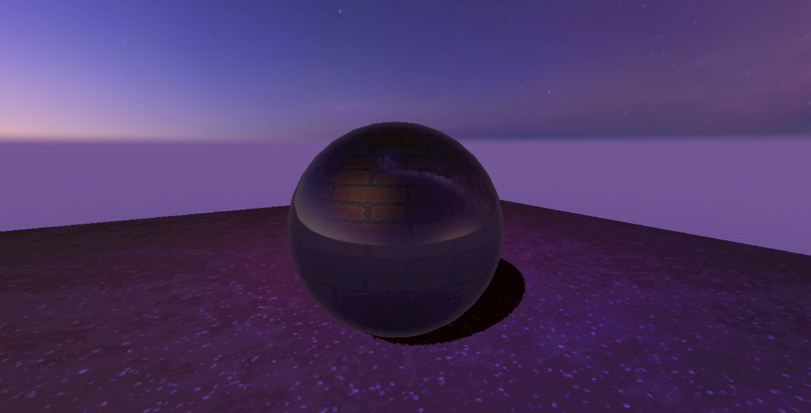
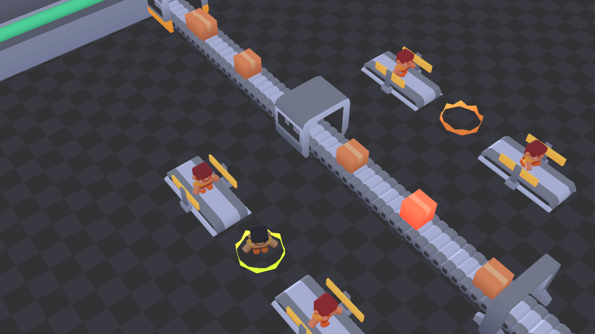

# Bane Game Engine (Work in progress)

OpenGL / SDL3

## Features
- Mesh / Skeletal Mesh importing
- Skeletal Animation, with (prototype) programmable control over arbitrary bones (rotation).
- Basic forward rendering
- Shadowmaps (single light source/directional light only)
- Cubemaps
- Basic Raycasting
- Basic AABB Collision detection

## Games 

### Human Power
Made in under 48 hours for Kenny's Game Jam 2025
https://itch.io/jam/kenney-jam-2025

Play here: https://starven.itch.io/human-power 

